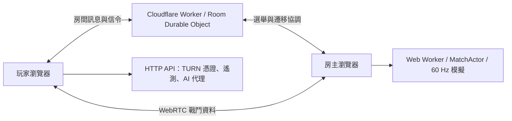

# Claude of Tanks：畫面、特效、後端與 TankForge 着色器對照研究


研究日期：2026-10-09
來源倉庫：https://github.com/Kevin-Liu-01/Claude-of-Tanks
研究版本：`6072b0de12b94a1090686c8cd79746326c8030ab`

## 1. 結論與研究範圍

Claude of Tanks 使用 Three.js 建立較完整的坦克遊戲渲染平台。現行網路架構由 Cloudflare 管理房間與連線協調，戰鬥計算則放在房主瀏覽器的 Web Worker，透過 WebRTC 向其他玩家傳送狀態。

其值得參考的部分是渲染品質管理、固定步長模擬、二進位增量協定、預測與插值，以及房間狀態機。若目標是公開競技遊戲，房主端權威的可信度與效能限制需要另行處理。

本研究以程式碼與工程文件為依據，沒有實際試玩、截圖比較或測量 FPS。本機副本刻意排除了非 MIT 素材、專有的 `src/vehicles/`、`src/world/`、衍生地圖碰撞資料與含品牌圖形的首頁，因此不能直接執行完整遊戲，也不能由此副本完整評估最終美術品質。

下載範圍與排除清單見 [SOURCE-IMPORT.json](claude-of-tanks-source-import.json)。

## 2. 畫面表現

### 2.1 渲染基礎與視覺方向

基礎技術為 Three.js、WebGL 與 TypeScript，視覺方向偏寫實軍事風格。光照、陰影、遠景空氣感、色彩與車輛細節共同構成觀感，不能僅用特效數量判斷品質。

| 技術 | 畫面作用 | 程式碼中的實作 |
| --- | --- | --- |
| 級聯陰影 CSM | 同時覆蓋近處坦克與遠處建築的太陽陰影 | 按畫質設定各級陰影貼圖；Ultra 為三個 4096 與一個 2048 |
| HDR、ACES 與色彩分級 | 保留亮暗層次，統一畫面色調 | 線性 HDR 處理後轉換為螢幕色彩 |
| 空氣透視 | 讓遠處山丘、樹線逐漸融入天空 | 根據深度計算遠景霧化與色彩 |
| 體積雲 | 表現雲層厚度、明暗與天氣 | 光線步進、低解析度運算與歷史重建；行動裝置不執行此層 |
| Bloom、太陽光束與鏡頭光暈 | 強化炮口、火焰與逆光 | 依畫質配置啟用，控制高亮溢出 |
| SMAA 與 FSR1 | 清理邊緣、重建低解析度場景 | EASU 空間升頻與 RCAS 銳化；HUD 不經過場景後處理 |

主要來源：[renderer.ts](https://github.com/Kevin-Liu-01/Claude-of-Tanks/blob/6072b0de12b94a1090686c8cd79746326c8030ab/src/engine/renderer.ts)、[post.ts](https://github.com/Kevin-Liu-01/Claude-of-Tanks/blob/6072b0de12b94a1090686c8cd79746326c8030ab/src/engine/post.ts)、[lighting.ts](https://github.com/Kevin-Liu-01/Claude-of-Tanks/blob/6072b0de12b94a1090686c8cd79746326c8030ab/src/engine/lighting.ts)、[volumetricClouds.ts](https://github.com/Kevin-Liu-01/Claude-of-Tanks/blob/6072b0de12b94a1090686c8cd79746326c8030ab/src/engine/volumetricClouds.ts)、[quality.ts](https://github.com/Kevin-Liu-01/Claude-of-Tanks/blob/6072b0de12b94a1090686c8cd79746326c8030ab/src/engine/quality.ts)。

### 2.2 後處理與預設的差異

`post.ts` 描述的主要管線為：

```text
場景渲染與可選 MSAA resolve
  → 空氣透視與高亮閃爍抑制
  → GTAO 階段
  → 晚期透明特效
  → Bloom
  → ACES、sRGB 與色彩分級
  → SMAA
  → FSR1 EASU 與 RCAS
```

這是管線能力，不代表所有預設都啟用全部效果。

- **GTAO 有完整實作，但目前畫質預設將 AO 強度設為零。** 註解說明這是為了避免顆粒狀暗部與額外成本，依靠級聯太陽陰影、接觸陰影等維持落地感。
- **桌面 TAA 預設關閉。** 程式碼保留此能力，但註解指出啟用後會降低地面與植被細節的微對比。
- **Ultra 使用 4× MSAA；High 不使用場景 MSAA。** High 主要依靠 SMAA 與 FSR1，在清晰度、閃爍與效能間取捨。
- **FSR1 是空間升頻與銳化。** 它不是 FSR2／FSR3，也不代表具有影格生成。

HUD 與 DOM 文字不經過場景升頻，所以降低內部渲染解析度時，介面文字仍可保持清楚。

### 2.3 效能與資源管理

程式碼針對瀏覽器執行加入多種管理機制：

- 動態解析度與依硬體能力調整的畫質策略。
- 遠處陰影降低更新頻率，保持陰影貼圖與投影姿態同步。
- 車庫靜止時減少重複繪製。
- 車庫與戰場分階段載入、管理場景及 GPU 資源駐留。
- 著色器預熱與受遮蔽的資源恢復，降低切換時的尖峰。
- WebGL context loss 偵測、恢復與失敗提示。

相關來源：[引擎維護文件](https://github.com/Kevin-Liu-01/Claude-of-Tanks/blob/6072b0de12b94a1090686c8cd79746326c8030ab/src/engine/SKILL.md)、[adaptiveQualityPolicy.ts](https://github.com/Kevin-Liu-01/Claude-of-Tanks/blob/6072b0de12b94a1090686c8cd79746326c8030ab/src/engine/adaptiveQualityPolicy.ts)、[phaseGpuResidency.ts](https://github.com/Kevin-Liu-01/Claude-of-Tanks/blob/6072b0de12b94a1090686c8cd79746326c8030ab/src/engine/phaseGpuResidency.ts)、[garageFramePacer.ts](https://github.com/Kevin-Liu-01/Claude-of-Tanks/blob/6072b0de12b94a1090686c8cd79746326c8030ab/src/engine/garageFramePacer.ts)。

### 2.4 畫面評價與待驗證項目

從結構來看，它比一般 Three.js 場景展示更完整，尤其重視渲染穩定性、資源生命週期與裝置降級。但最終品質高度依賴已排除的車輛、地形和素材，不能只憑程式碼認定達到商業客戶端遊戲水準。

實際試玩應優先檢查植被與細小高亮的閃爍、遠景陰影穩定性、車庫與戰場切換卡頓、多人戰鬥下的影格尖峰，以及行動裝置的清晰度與持續效能。現有註解中的效能數字屬上游測試紀錄，並非本次獨立量測。

## 3. 特效系統研究

### 3.1 整體架構

戰鬥特效由 [effects.ts](https://github.com/Kevin-Liu-01/Claude-of-Tanks/blob/6072b0de12b94a1090686c8cd79746326c8030ab/src/fx/effects.ts) 統一協調，[particles.ts](https://github.com/Kevin-Liu-01/Claude-of-Tanks/blob/6072b0de12b94a1090686c8cd79746326c8030ab/src/fx/particles.ts) 管理實例化粒子池，[impactDecals.ts](https://github.com/Kevin-Liu-01/Claude-of-Tanks/blob/6072b0de12b94a1090686c8cd79746326c8030ab/src/fx/impactDecals.ts) 管理裝甲命中痕跡，[clock.ts](https://github.com/Kevin-Liu-01/Claude-of-Tanks/blob/6072b0de12b94a1090686c8cd79746326c8030ab/src/fx/clock.ts) 管理共用動畫時鐘。

特效讀取射擊、命中、模組損壞、著火與摧毀事件，不以畫面上的火花或爆炸來決定傷害。部分小型道具破壞透過世界系統的表現接口串接，仍須區分裝飾破壞與權威戰鬥結果。

```text
權威事件／允許的本地開火預測
  → 特效協調與事件排程
  → 粒子、曳光、命中貼花、短期光源及模型動畫接口
  → 讀取場景深度的透明特效階段
  → Bloom、色彩處理與最終輸出
```

### 3.2 特效種類與視覺設計

| 類別 | 程式碼中的表現 | 技術重點 |
| --- | --- | --- |
| 主炮開火 | 炮口亮芯、噴焰、側向火光、火藥煙、炮口壓力環與地面塵浪 | 多層卡片及粒子疊加，短期點光源；尺寸依口徑調整 |
| 火箭／導彈 | 點火、尾焰、煙跡與可見導彈本體 | 與主炮分開處理，不套用主炮制退器噴焰或脫殼效果 |
| 曳光與飛行 | 依 AP、APCR、APFSDS、HEAT、HE 等類型配置曳光 | 實例化線段／卡片；ATGM 本體跟隨活躍炮彈位置 |
| APFSDS 脫殼 | 發射後出現脫離的彈托瓣 | 由確認的射擊事件觸發，與本地預測閃光分開 |
| 裝甲穿透與未穿透 | 命中亮點、不同強度的火花及煙，留下不同痕跡 | 按命中類型分流，避免每次命中都變成同一顆火球 |
| 跳彈 | 沿裝甲表面展開的拉長火花與金屬刮痕 | 刮痕按入射方向在表面上的投影定向，不留下穿孔 |
| 反應裝甲 ERA | 定向小爆破、火花、煙和熱碎片 | ERA 啟動與後續穿透可以同時呈現，不互相覆蓋 |
| 高爆、地面與建築命中 | 火球、土柱、塵煙、碎屑；建築命中為局部閃光與材料碎片 | 依命中介質與口徑調整，讓炮彈停止位置可讀 |
| 車輛摧毀 | 火球、煙塵、熱碎塊、地面衝擊環、焦痕、持續火煙 | 區分彈藥架爆炸、炮擊及火災；拋塔與燒焦動畫透過車輛接口串接 |
| 履帶與引擎 | 履帶揚塵、排氣、地面履帶印；履帶損壞時有碎鏈與火花 | 隨地面種類、運動與接觸狀態變化 |
| 水面互動 | 炮彈水柱、泡沫、涉水飛濺與尾流 | 對水面接口注入擾動；水場實作位於已排除的世界內容 |
| 輔助武器與煙幕 | 小口徑閃光、彈殼、煙幕罐拋射和煙幕視覺 | 使用固定實例池，煙幕表現讀取共享模擬狀態 |

主要來源：[effects.ts](https://github.com/Kevin-Liu-01/Claude-of-Tanks/blob/6072b0de12b94a1090686c8cd79746326c8030ab/src/fx/effects.ts)、[auxiliaryPresentation.ts](https://github.com/Kevin-Liu-01/Claude-of-Tanks/blob/6072b0de12b94a1090686c8cd79746326c8030ab/src/fx/auxiliaryPresentation.ts)、[aerialTracers.ts](https://github.com/Kevin-Liu-01/Claude-of-Tanks/blob/6072b0de12b94a1090686c8cd79746326c8030ab/src/fx/aerialTracers.ts)。車輛拋塔、燒焦、殘骸幾何及世界水面只能確認接口與呼叫，不能由此副本完整審查其專有實作。

### 3.3 粒子技術：GPU 動畫與固定池

核心使用 `InstancedBufferGeometry` billboard，而不是逐顆建立 `THREE.Sprite` 或 `THREE.Points`。煙火多為朝向攝影機的面片，碎屑則使用帶光照的不規則塊狀幾何。

CPU 在發射時把位置、速度、出生時間、壽命、大小、顏色及旋轉等寫入環形緩衝區，使用局部 attribute 上傳；shader 隨共用 `uTime` 計算移動、縮放、淡出及翻頁動畫。這是解析式 GPU 粒子動畫，不是 compute shader 流體模擬，也不能推論具有完整粒子間碰撞。

目前 `POOL_SIZES` 宣告如下，數字代表配置容量而非每幀活躍數：

| 粒子池 | 容量 | 用途 |
| --- | ---: | --- |
| smoke | 2048 | 一般煙霧與尾跡 |
| fire | 1024 | 火焰亮部 |
| billow | 256 | 火球內部的煙火團 |
| psmoke | 384 | 炮口火藥煙 |
| screen | 768 | 煙幕 |
| dust | 1024 | 地面塵土 |
| sparks | 512 | 火花長條 |
| debris | 256 | 飛散碎塊 |
| flash | 128 | 短期閃光卡片 |
| jet | 64 | 定向噴焰 |

另外，曳光配置上限為 256，ATGM 本體池為 12，持續煙柱最多 4。固定池降低物件配置和記憶體成長，但容量滿時的覆寫或淘汰會造成視覺折衷；同時大量摧毀時不能期待每具殘骸都保有完整煙柱。

### 3.4 如何避免煙火像平面貼圖

實作包含幾個值得參考的細節：

- **Flipbook 與侵蝕遮罩：** 煙火圖集隨粒子年齡切換並插值，遮罩逐步侵蝕外形，避免單純放大、淡出圓形貼圖。
- **Soft particles：** 讀取已解析的場景深度，柔化煙與地面、裝甲的交界。透明特效使用獨立晚期階段，避免同時讀寫同一個深度附件。
- **不同混合方式：** 煙塵主要普通透明混合，火焰與閃光採加法亮部；火球另外有普通混合的煙火團，避免整片亮黃洗白。
- **煙霧方向明暗：** 在 billboard 上依太陽方向做近似煙體照明，增加厚度感；這不是煙體積內的完整光線傳輸。
- **HDR 高亮限制：** 單張卡片有亮度 soft-knee，後處理也抑制孤立亮點，控制多層加法疊加造成的過曝與 Bloom 閃爍。

粒子可預載 `/fx/particles-*.png` 圖集，也有 Canvas 程序化圖集生成與分段暖機路徑。但已排除的素材仍不能視為 MIT；有生成程式也不自動代表其生成結果可任意重用，需依上游 Reserved Content 政策另行判斷。

### 3.5 光源、貼花與空間附著

動態特效燈固定使用兩盞共用 `PointLight`，分別用於炮口和爆炸，且不投射動態陰影。當前常數為 `MUZZLE_LIGHT_S = 0.14` 與 `EXPLOSION_LIGHT_S = 1.9`；檔頭的 90 ms／1.1 s 是舊註解。光強另有起亮、衰減與閃動曲線，並非生命週期內維持全亮。

這讓光源數量固定，避免每次開火都增加照明成本；代價是多處同時射擊或爆炸無法各自持有完整獨立點光源。

命中貼花使用 1024×1024 共用 Canvas 圖集，分為穿孔、重度穿透、跳彈刮痕、高爆焦痕與未穿透擦傷。每車最多 24 張，超出後淘汰最舊記錄，並依車體、炮塔或炮組節點批次組合。貼花跟隨權威事件給出的關節局部接觸座標，避免坦克移動或炮塔轉向後痕跡漂移。這些是表面視覺標記，不是實際切開裝甲網格的幾何孔洞。

[effectAttachments.ts](https://github.com/Kevin-Liu-01/Claude-of-Tanks/blob/6072b0de12b94a1090686c8cd79746326c8030ab/src/fx/effectAttachments.ts) 明確區分座標空間：持續燃燒發射器跟隨車輛，已出生粒子留在世界空間；貼花跟隨被擊中的節點；履帶印和地面焦痕固定在世界上。這能避免煙跟車一起硬移動，或殘骸移除後煙柱仍持續存在。

### 3.6 聯機事件與時間一致性

[events.ts](https://github.com/Kevin-Liu-01/Claude-of-Tanks/blob/6072b0de12b94a1090686c8cd79746326c8030ab/src/mp/match/events.ts) 的可靠事件佇列按呈現 tick 釋放事件，預設每次 flush 最多 3 個，遇到重型特效可以提早結束。為避免齊射被預算拆成過度延遲的連續爆炸，事件超過自身 tick 4 個模擬步長後，可突破一般預算釋放。這是預算內的延後限制，並不保證實際網路加畫面延遲不超過約 67 ms。

本地開火可以先預測炮口閃光，之後權威確認以 `feedbackPredicted` 避免重複呈現；傷害、脫殼與世界交互仍依確認事件處理。

共用 FX 時鐘統一粒子、後座、拋塔煙跡等時間接口，可暫停或步進至指定時間，適合重播、Studio 和固定時刻比較。`resetAll()` 清空粒子、貼花、曳光、煙柱、光源和相關記錄；特效模組則由 [fxRuntimeAccess.ts](https://github.com/Kevin-Liu-01/Claude-of-Tanks/blob/6072b0de12b94a1090686c8cd79746326c8030ab/src/fx/fxRuntimeAccess.ts) 戰鬥時按需取得，預載程式碼不必立即配置場景資源。

### 3.7 天氣與光學效果的邊界

目前 [battleWeatherPolicy.ts](https://github.com/Kevin-Liu-01/Claude-of-Tanks/blob/6072b0de12b94a1090686c8cd79746326c8030ab/src/engine/battleWeatherPolicy.ts) 僅為每場選定白天、黃昏或夜晚，天氣狀態固定為 clear，降水強度為零。不能將天空及體積雲推論成已有動態雨雪粒子或連續晝夜循環。

接觸陰影、地面反彈光、太陽光束、鏡頭光暈及車體腔體遮蔽由 [postLightFxPolicy.ts](https://github.com/Kevin-Liu-01/Claude-of-Tanks/blob/6072b0de12b94a1090686c8cd79746326c8030ab/src/engine/postLightFxPolicy.ts) 按預設與 QA 開關控制；此策略在行動裝置上關閉這五項效果，不表示所有戰鬥粒子都關閉。

### 3.8 特效評價與後續驗證

強項是事件語意清楚、混合材質與深度交界處理、固定資源預算、關節附著，以及可重現的時間控制。這套設計更接近完整遊戲特效框架，而不是幾個獨立粒子範例。

最需要實測的成本是大量半透明煙火造成的像素重複覆蓋，而不只是 draw call。固定池和實例化能降低 CPU 成本，卻不會消除透明 overdraw、圖集採樣或後處理頻寬。應測試多人齊射、近距離爆炸、煙幕遮滿畫面、連續殘骸與低階裝置，並確認事件延遲、煙柱淘汰、共用光源搶占及跨局清理的觀感。

本節仍屬原始碼研究，未實際渲染、量測 GPU 成本或完整執行特效測試。

## 4. 後端與多人連線架構

### 4.1 現行拓撲



**房間服務與戰鬥權威是不同的部分。** 雲端房間保存和協調玩家狀態；房主瀏覽器執行戰鬥裁定。

早期 `MULTIPLAYER-V2.md` 曾規劃 Cloudflare Containers 的獨立戰鬥服務，但後續設計已變更。現行 [wrangler.jsonc](https://github.com/Kevin-Liu-01/Claude-of-Tanks/blob/6072b0de12b94a1090686c8cd79746326c8030ab/cloudflare/rooms/wrangler.jsonc) 明確寫出房主瀏覽器運算，且包含刪除 `MatchContainer` 的 migration。文件前段的目標架構不能當成當前部署狀態。

### 4.2 各部分技術與職責

| 部分 | 技術與職責 |
| --- | --- |
| 房間服務 | Cloudflare Workers 與 Durable Objects；座位、隊伍、準備狀態及主機遷移協調 |
| 房間儲存 | Durable Object 內 SQLite；WebSocket 休眠與 alarm 管理生命週期 |
| 戰鬥權威 | 房主瀏覽器的 Web Worker，執行共享 MatchActor 與模擬邏輯 |
| 戰鬥傳輸 | WebRTC；嚴格 NAT 情境可使用 TURN 中繼 |
| 區域網路 | Node.js 與 ws；可在本機程序執行同一戰鬥邏輯 |
| 遙測 | Cloudflare Analytics Engine；啟動、進入遊戲、錯誤與階段耗時 |
| 輔助 API | 短期 TURN 憑證、GitHub 星數與 AI 指揮官代理等 |

主要來源：[技術總覽](https://github.com/Kevin-Liu-01/Claude-of-Tanks/blob/6072b0de12b94a1090686c8cd79746326c8030ab/docs/TECHNICAL-OVERVIEW.md)、[多人連線設計與變更紀錄](https://github.com/Kevin-Liu-01/Claude-of-Tanks/blob/6072b0de12b94a1090686c8cd79746326c8030ab/docs/MULTIPLAYER-V2.md)、[Match service 文件](https://github.com/Kevin-Liu-01/Claude-of-Tanks/blob/6072b0de12b94a1090686c8cd79746326c8030ab/server/match/README.md)、[Room Durable Object](https://github.com/Kevin-Liu-01/Claude-of-Tanks/blob/6072b0de12b94a1090686c8cd79746326c8030ab/cloudflare/rooms/src/room.ts)。

### 4.3 模擬、協定與同步

| 機制 | 現行程式碼行為 | 用途 |
| --- | --- | --- |
| 固定模擬步長 | 60 Hz | 顯示刷新率不改變移動、裝填或戰鬥計時 |
| 快照頻率 | 預設 20 Hz，可配置其他能整除 60 的頻率 | 降低房主上傳負擔 |
| 本地預測 | 先響應操作，再依權威狀態回放未確認輸入 | 減少操作等待感 |
| 遠端插值 | 在收到的狀態樣本間平滑位置與角度 | 平滑其他坦克的移動 |
| 延遲補償 | 約 400 ms 姿態歷史，最多回溯 250 ms | 按射手看到的較早姿態判定炮彈掃掠 |
| 二進位增量協定 | 以已確認快照作基線傳送變更 | 降低頻寬與序列化成本 |
| 距離分檔 | 100 m 內每次、300 m 內每兩次、更遠每三次更新 | 降低遠處實體同步成本 |
| 交戰提升 | 命中、近失彈或碰撞後暫時提升更新頻率 | 保持交戰對象的狀態新鮮度 |
| 可見性過濾 | 未被發現的敵人不進入普通觀察者快照 | 避免向客戶端洩露隱藏座標 |
| 背壓控制 | 對積壓連線跳過過期快照 | 避免無限排隊與延遲累積 |

部分文件仍描述 30 Hz，但 [協定常數](https://github.com/Kevin-Liu-01/Claude-of-Tanks/blob/6072b0de12b94a1090686c8cd79746326c8030ab/src/mp/wire/constants.ts) 中 `SNAPSHOT_HZ = 20` 是此版本的預設。玩家數目上限常數也不等於已驗證的可用容量；14v14 的測試紀錄應與真實網路、房主硬體和測試條件一起解讀。

關鍵來源：[MatchActor](https://github.com/Kevin-Liu-01/Claude-of-Tanks/blob/6072b0de12b94a1090686c8cd79746326c8030ab/server/match/matchActor.ts)、[延遲補償](https://github.com/Kevin-Liu-01/Claude-of-Tanks/blob/6072b0de12b94a1090686c8cd79746326c8030ab/server/match/lagCompensation.ts)、[同步頻率分檔](https://github.com/Kevin-Liu-01/Claude-of-Tanks/blob/6072b0de12b94a1090686c8cd79746326c8030ab/server/match/interestTiers.ts)、[房主 Worker](https://github.com/Kevin-Liu-01/Claude-of-Tanks/blob/6072b0de12b94a1090686c8cd79746326c8030ab/src/mp/host/matchHostWorker.ts)。

### 4.4 周邊服務與持久化

TURN API 從服務端秘密產生短期憑證，避免將固定憑證提交到程式碼。AI 指揮官代理在服務端持有上游金鑰、驗證請求與限制呼叫，不是讓瀏覽器直接使用服務金鑰。

遙測 Worker 接收匿名啟動及錯誤 beacon，驗證來源、大小與欄位，寫入 Analytics Engine；這不是玩家帳號資料庫。此版本的玩家 profile 使用 `localStorage`，該部分沒有提供雲端帳號或跨裝置進度持久化。

來源：[ice.ts](https://github.com/Kevin-Liu-01/Claude-of-Tanks/blob/6072b0de12b94a1090686c8cd79746326c8030ab/api/ice.ts)、[jev.ts](https://github.com/Kevin-Liu-01/Claude-of-Tanks/blob/6072b0de12b94a1090686c8cd79746326c8030ab/api/jev.ts)、[遙測服務文件](https://github.com/Kevin-Liu-01/Claude-of-Tanks/blob/6072b0de12b94a1090686c8cd79746326c8030ab/cloudflare/telemetry/README.md)、[profile.ts](https://github.com/Kevin-Liu-01/Claude-of-Tanks/blob/6072b0de12b94a1090686c8cd79746326c8030ab/src/game/profile.ts)。

## 5. 優勢與限制

### 5.1 優勢

- 適合低成本運營、朋友私人房間與區域網路。
- 同一套 TypeScript 模擬可在瀏覽器與 Node 重用，降低規則分歧。
- 純模擬與網路核心不依賴 DOM／WebGL，便於無畫面測試。
- 房間狀態與房主角色分離，主機遷移改善退出後的連續性。
- 渲染端對畫質降級、資源生命週期與恢復有較完整的處理。

### 5.2 限制

- 房主硬體、上傳頻寬與瀏覽器調度會影響全場；Worker 隔離主執行緒，但無法消除這些限制。
- 戰鬥權威運行於玩家裝置，無法提供獨立可信伺服器同等的防作弊保證。其他客戶端只提交控制意圖，也不能解決惡意房主問題。
- 主機遷移需要還原狀態與重建連線，不能直接承諾無感切換。
- TURN 中繼會增加網路依賴及可能的流量成本；P2P 不代表所有流量都免費。
- 目前看到的 profile 與遙測設計不等於完整帳號、排位、經濟或跨裝置存檔系統。
- MIT 程式碼子集缺少專有車輛、世界與素材，完整產品仍需自製或另行取得授權的內容。

## 6. 對後續開發的建議

若目標是朋友之間的瀏覽器坦克遊戲，現有房間與 P2P 拓撲符合成本及使用情境，可優先研究房間狀態機、遷移、二進位快照與畫質管理。

若目標是公開競技遊戲，建議將共享 MatchActor 移到獨立可信伺服器，重新設計部署與容量管理，再補上帳號、持久化進度及對戰結果保存。現有 Node 共享邏輯可作基礎，但不能把已移除的容器設計當成可直接部署的完成方案。

畫面方面，先建立自有車輛與場景的可執行原型，再於固定解析度、硬體與場景條件下測量 FPS、影格時間 p95／p99、GPU 記憶體及切換尖峰。以實測決定陰影、雲層與後處理預算，避免單純堆疊效果。

## 7. 授權與證據說明

上游第一方程式碼預設採 MIT，但明確列出的 Reserved Content 與第三方作品遵循各自授權。程序化幾何或以程式碼表示的地形不會因為是原始碼就自動成為 MIT 內容。

請以 [LICENSE-POLICY.md](https://github.com/Kevin-Liu-01/Claude-of-Tanks/blob/6072b0de12b94a1090686c8cd79746326c8030ab/LICENSE-POLICY.md)、[NOTICE.md](https://github.com/Kevin-Liu-01/Claude-of-Tanks/blob/6072b0de12b94a1090686c8cd79746326c8030ab/NOTICE.md)、[第三方來源紀錄](https://github.com/Kevin-Liu-01/Claude-of-Tanks/blob/6072b0de12b94a1090686c8cd79746326c8030ab/docs/ATTRIBUTION.md) 與個別檔案聲明為準。本文件是技術研究，不重新授權上游內容。

本次未安裝依賴、執行完整測試或啟動遊戲。架構與預設數值由當前版本程式碼確認；美術品質、實際效能、跨瀏覽器相容性與真實網路可靠度仍需另行驗證。


## 8. TankForge 着色器對照


研究日期：2026-10-09。

TankForge 基线：[`8f547c5e`](https://github.com/monpai-lover/tankforge/tree/8f547c5e0dab73639801ab3079baf67eec132e08)。Claude of Tanks 参考版本：[`6072b0de`](https://github.com/Kevin-Liu-01/Claude-of-Tanks/tree/6072b0de12b94a1090686c8cd79746326c8030ab)。本文只研究参考仓库的 MIT 默认覆盖范围，不包含其专有车辆、世界代码、贴图和美术标定数据。

### 8.1 结论：保留自有 WebGL2 架构，迁移算法而非框架

TankForge 已经有自写 WebGL2 渲染器，不是 Three.js 项目。它具有 GGX 材质、线性 HDR、大气单次散射、体积云、云影、光束、Bloom、高度雾、软粒子及动态分辨率。升级不必从零重建，也不需要为了参考 Claude of Tanks 而换引擎。

当前最值得借鉴的部分依次为：阴影采样稳定性与覆盖范围、降分辨率后的空间重建、直接光与间接光分开处理、针对车辆的接触及腔体遮蔽，以及重型天空和粒子计算的分摊方式。

本文是代码学习与适配建议，没有修改实际着色器，没有进行渲染效果或 GPU 性能实测。功能存在与功能默认开启分别核对，历史注释不能替代当前控制逻辑。

### 8.2 两套渲染流程与已有能力

#### TankForge 当前流程

```text
初始化生成 3D 噪声
  → 分块更新天空穹顶：大气 + 云
  → 单张太阳阴影图
  → 前向材质：太阳 × 物体阴影 × 云影 + 半球光 + 天空反射
  → 可选 MSAA 场景解析，取得颜色与深度
  → 独立软粒子层
  → 半尺寸光束、四分之一尺寸 Bloom
  → 高度雾 + 散射 + 粒子合成 + 曝光 + ACES + 色彩
  → 可选像素风格
```

来源：[renderer.js](../client/web/src/gfx/renderer.js)、[shaders.js](../client/web/src/gfx/shaders.js)、[atmosphere.js](../client/web/src/gfx/atmosphere.js)。

#### Claude of Tanks 参考流程

```text
大气 LUT 与环境照明
  → 多级太阳阴影，按级调度更新
  → HDR 场景与可选 MSAA
  → 空气透视、接触阴影、车辆腔体遮蔽、高亮闪烁抑制
  → 可选 GTAO（当前预设关闭）
  → 晚期透明战斗特效
  → Bloom
  → ACES + 输出色彩转换 + 分级
  → SMAA
  → FSR1 EASU + RCAS
```

来源：[post.ts](https://github.com/Kevin-Liu-01/Claude-of-Tanks/blob/6072b0de12b94a1090686c8cd79746326c8030ab/src/engine/post.ts)、[quality.ts](https://github.com/Kevin-Liu-01/Claude-of-Tanks/blob/6072b0de12b94a1090686c8cd79746326c8030ab/src/engine/quality.ts)。TAA 代码存在，但桌面预设默认关闭；High 不开启场景 MSAA，Ultra 为 4×。体积云文件头保留旧的 opt-in 描述，实际 `sky.ts` 控制逻辑在支持的路径上默认允许，`clouds=off` 或 `baked` 禁用。

#### 逐项对照

| 项目 | TankForge 已有 | Claude of Tanks 可学习点 |
| --- | --- | --- |
| 材质 | GGX、Schlick Fresnel、金属度／粗糙度、导数凹凸与导数切线法线贴图 | 控制微小高亮、区分太阳和环境光的遮蔽 |
| 太阳阴影 | 2048 单图、3×3 PCF、跟随 focus | 级联覆盖、光空间 texel 对齐、各级 bias 与更新调度 |
| 大气 | 12 个视线采样，每步 4 个光照采样；天空分块缓存 | 透射率、多次散射与天空视图 LUT，参数变化才重建 |
| 云 | 3D 噪声、光线步进、云影、16 块穹顶更新 | 屏幕稀疏采样、历史重投影、邻域限制与空空间跳步 |
| 烟火 | CPU 粒子、软深度交界、噪声侵蚀、烟的近似受光 | 固定实例池、出生时上传、共用 shader 时钟 |
| 后处理 | Bloom、ACES、高度雾、光束、线性采样放大 | SMAA、FSR1、邻域高亮限制与定向色彩处理 |
| 降级 | 渲染比例 0.7–1，快速降、缓慢升，反弹后延长等待 | 进一步区分分辨率压力、重型效果压力及硬件上限 |

源码已经在 `game/fx.js` 和 `gfx/renderscale.js` 注释中注明参考 Claude of Tanks；[SOURCES.md](../SOURCES.md) 也记录了这部分学习。软粒子和动态分辨率属于继续完善的基础，不应重新列为尚未实现的功能。

### 8.3 阴影：先稳定，再扩展覆盖

#### 当前观察

TankForge 使用 `SHADOW_EXTENT = 24`，正交投影在光空间 x、y 各覆盖 `[-24, 24]`，即每轴约 48 m。超过阴影图投影范围的片元直接返回可见太阳。对于公里级地图，近车可得到高 texel 密度，但远处物体不在同一张物体阴影图的覆盖内；云影是另一项独立计算。

`lightVP` 每帧直接跟随 focus，未在此路径看到光空间 texel snapping。PCF 使用固定深度偏置 `0.0022`，阴影绘制另加 `polygonOffset(2, 4)`。这些是当前实现观察，尚未通过实际画面确认抖动或悬浮程度。

#### 参考算法与适配

Claude of Tanks 将太阳阴影按视距分成多个 cascade，为不同覆盖范围分配贴图尺寸；[shadowStability.ts](https://github.com/Kevin-Liu-01/Claude-of-Tanks/blob/6072b0de12b94a1090686c8cd79746326c8030ab/src/engine/shadowStability.ts) 对光空间坐标做 texel 对齐，并按物理 texel 尺寸调整法线偏置。

```text
worldUnitsPerTexel = cascadeSpan / shadowResolution
snappedCoordinate = floor(lightSpaceCoordinate / worldUnitsPerTexel)
                    × worldUnitsPerTexel
```

建议先对现有单图实现光空间中心对齐，再试两级或三级 CSM，而不是直接扩大单图或照搬四张高分辨率贴图。级联切换需要混合，最远级可以降低更新频率；每次必须同时更新该级的投影矩阵和深度图，不能移动投影却采样上一姿态的旧图。

TankForge 的太阳方向、矩阵及米制坐标应由自身接口提供。不要直接复制参考项目的 bias 数值、远平面或曝光，它们对应不同的投影、模型比例与光照标定。

### 8.4 直接光和间接光分开处理

#### 8.4.1 接触阴影

参考 [contactShadows.ts](https://github.com/Kevin-Liu-01/Claude-of-Tanks/blob/6072b0de12b94a1090686c8cd79746326c8030ab/src/engine/contactShadows.ts) 在空气透视 pass 中，沿太阳方向对场景深度做短距离搜索，补足履带、轮子和墙脚与地面的细缝。当前为 12 个采样，靠近接触点更密，远距离淡出。

关键不只是 ray march，而是只扣除太阳直射部分，避免把已经在阴影中的环境光再压黑：

```text
sunShare = directSun / (directSun + ambient)
result ≈ sceneColor × (1 − occlusion × sunShare)
```

这是说明性表达；参考项目实际使用可见度及估计的光照份额，并非拥有完整延迟渲染 G-buffer。

TankForge 已有解析深度和视线重建，可以在新增屏幕阶段或 composite 中实验。但还需太阳可见度和材质分类，否则会误伤透明水面、树叶和未受光对象。不能在当前场景绘制时直接读取同一 framebuffer 的深度附件，这会产生反馈风险。

#### 8.4.2 车辆腔体遮蔽

参考 [vehicleOcclusion.ts](https://github.com/Kevin-Liu-01/Claude-of-Tanks/blob/6072b0de12b94a1090686c8cd79746326c8030ab/src/engine/vehicleOcclusion.ts) 只对车辆像素搜索周围深度高程；固定 8 个方向、每方向 4 步，世界半径 0.8 m，120 m 之外淡出。目的是让炮塔环、裙板后方和轮舱有层次，同时避开场景级 GTAO 对草地、树叶的颗粒污染。

```text
result ≈ sceneColor × [1 − cavity × strength × (1 − sunShare)]
```

它主要压低环境光份额，与接触阴影主要压低太阳份额互补。TankForge 的 `litFS` 已分别计算 `direct`、`amb`、`env`，便于从概念上保持这一区分。

#### 8.4.3 场景 alpha 元数据不能直接照搬

参考项目在浮点 HDR 的 alpha 中存储 `2 + sunVisibility`，车辆再增加分类标记，供后处理识别。TankForge 当前 alpha 还表示透明度，而且会回退至 RGBA8；大于 1 的编码在归一化 RGBA8 中会被截断。因此应设计单独、格式明确的 mask／光照 metadata attachment，或使用适合自身的打包方式，并核对 WebGL2 MRT 与 MSAA resolve 路径。

#### 8.4.4 地面反弹光

参考 [groundBounce.ts](https://github.com/Kevin-Liu-01/Claude-of-Tanks/blob/6072b0de12b94a1090686c8cd79746326c8030ab/src/engine/groundBounce.ts) 用解析式估计朝下表面看到的地面反射，不是完整 GI：

```text
lowerHemisphereView = clamp((1 − normal.y) / 2, 0, 1)
bounce = max(estimatedSunlitGround − existingGroundFill, 0)
         × lowerHemisphereView
```

实际还按太阳高度、面朝向和阴影可见度修正。TankForge 已有 `uGroundColor` 与半球光，适配时应只补缺失的部分，避免把地面环境光加两次。若暗面已经过亮，应先调整现有填充光，而不是无条件加 bounce。

### 8.5 降分辨率后的清晰度与高亮稳定性

#### 8.5.1 FSR1 和抗锯齿

TankForge 的动态分辨率最后通过 composite 的普通纹理采样放大。可学习参考 `post.ts` 的 EASU 边缘自适应空间重建与 RCAS 对比度自适应锐化，让 0.7–0.9 比例的画面少一些放大后的模糊。

实施前应明确渲染尺寸和原生 canvas 尺寸，将 scene/composite 先输出至中间图，再在明确的输出色彩空间做抗锯齿和重建。保留像素风格模式独立路径，HUD 也应保持原生显示。

FSR1 不使用运动向量，没有影格生成，不等于 FSR2／FSR3，也不能消除所有时间闪烁。SMAA、MSAA 与 FSR1 各解决不同问题，不能用“更锐”替代“抗锯齿”。参考项目已经试过 TAA 并因细节损失将其默认关闭，不能只因代码中存在就推荐默认启用。

#### 8.5.2 Firefly 与 Bloom

参考后处理在 Bloom 前检测孤立 HDR 高亮，与邻近亮度比较后限制异常峰值；粒子还按卡片做 soft-knee。TankForge 已有粒子亮度压缩及 Bloom 输入上限，下一步可以对“细小金属高光引发整片 Bloom 闪动”做邻域实验。

重点是保留合理的炮口及太阳高亮，不把所有发光压成普通颜色。测试应比较行驶中的玻璃、远处金属边缘、树叶和夜间炮口；静态截图无法证明时间稳定性。

#### 8.5.3 HDR 回退与合成约定

TankForge 支持 RGBA16F，也在不支持浮点颜色目标时用 RGBA8 的 `ENC`／`DEC` 压缩。增加 pass 必须保持“哪个 buffer 是线性颜色、哪个已经编码、哪个存储预乘 alpha”的契约，不能简单复制参考项目默认浮点 HDR 的片元输出。

例如透明混合在何种空间执行，以及雾和 Bloom 是否正确解码，应作为回退设备测试项。这里是适配时需验证的风险，不是本次已复现的错误。

### 8.6 天空与粒子：已有基础，优化计算分摊

#### 8.6.1 大气 LUT

TankForge 单次散射算法已经按论文实现，不需要用“新增大气”作为升级目标。参考 [atmosphere.ts](https://github.com/Kevin-Liu-01/Claude-of-Tanks/blob/6072b0de12b94a1090686c8cd79746326c8030ab/src/engine/atmosphere.ts) 将透射率缓存为 256×64、多次散射为 32×32、天空视图为 200×100，只在相关参数变化时重建。

可把天空辐射计算从云采样循环中分开，减少重复积分，并统一环境填充、地平线颜色和空中雾化使用的天空来源。是否值得替换，需以现有穹顶分块更新的实际 GPU 成本决定；它本来就有缓存，并非每帧全屏重新积分。

#### 8.6.2 体积云历史重建

TankForge 用 4×4 大块穹顶更新，一次完整扫过为 16 帧，并将新旧穹顶渐变。参考 [volumetricClouds.ts](https://github.com/Kevin-Liu-01/Claude-of-Tanks/blob/6072b0de12b94a1090686c8cd79746326c8030ab/src/engine/volumetricClouds.ts) 则在半分辨率历史中交错采样，使用 4×4 Bayer 顺序、历史重投影和邻域限制，并跳过空云区。

两者都有时间分摊，但缓存坐标不同。不能把参考屏幕空间重投影矩阵原封不动接到 TankForge 的穹顶方向纹理。优先学习空空间跳步与相机切换时的历史失效策略，再评估是否改为屏幕交错重建。近地移动、快速转向及改变视野角应单独测试。

#### 8.6.3 固定 GPU 粒子池

TankForge 当前在 CPU 中更新粒子对象，使用 `push`、`shift`、`splice` 管理寿命，再生成 billboard 顶点。参考 [particles.ts](https://github.com/Kevin-Liu-01/Claude-of-Tanks/blob/6072b0de12b94a1090686c8cd79746326c8030ab/src/fx/particles.ts) 采用固定实例池，在发射时上传初始参数，用共用时间计算位置、大小、旋转与图集进度。

对应 WebGL2 可使用 instanced attributes 与 `drawArraysInstanced`，先迁移普通烟尘，再迁移火焰和火花。需要 CPU 碰撞的碎块可保留单独路径。shader 解析运动不是完整物理碰撞或流体模拟；实例化降低 CPU／上传成本，但不解决大量透明粒子覆盖同一像素的 fill-rate 成本。

### 8.7 建议顺序与验收

以下是研究后的建议，没有实施这些改变。

| 顺序 | 改动方向 | 要验证的结果 |
| --- | --- | --- |
| 1 | 现有阴影 texel 对齐与 bias 检查 | 固定镜头与慢速行驶中阴影稳定，斜面不增加 acne，履带不悬浮 |
| 2 | 先两级或三级 CSM，明确近中远预算 | 远处车辆和建筑得到阴影，级联边界无突变，最差帧成本受控 |
| 3 | 降分辨率重建与选择性高亮抑制 | 比较 1.0、0.9、0.7 比例下轮廓、树叶、炮口；避免锐化光晕 |
| 4 | 元数据格式与车辆局部遮蔽 | 只影响车辆及正确光照份额，透明物体不误判，HDR 回退可用 |
| 5 | 大气 LUT 与云空空间跳步 | 相同天空条件减少 GPU 开销，转镜头和变时段不残留历史 |
| 6 | 烟尘的 GPU 实例池 | 齐射时降低 CPU 分配与顶点上传，暂停／重播和跨局清理正确 |

每次改动都应保留开关，固定车辆、地图、镜头、时间与随机种子进行 A/B，再观察移动序列。记录 CPU/GPU 时间、p95／p99 影格时间、目标分辨率及绘制预算；GPU 查询需处理 disjoint，软件渲染结果不能冒充玩家硬件性能。

初次导入时的基线为网页 `npm test` 57 项通过；当时尚未安装 Rust，也未执行浏览器图形测试。后续车辆修复已安装隔离的 Rust 工具链，并执行后端与真实 WebGL 回归，结果见 [本轮修复验收](vehicle-fixes-2026-10-09.md)。这些检查不代表已经实施或验证本节建议的全部着色器改动。

### 8.8 授权与来源边界

参考项目采用 MIT 默认授权及明确专有内容例外，见 [LICENSE-POLICY.md](https://github.com/Kevin-Liu-01/Claude-of-Tanks/blob/6072b0de12b94a1090686c8cd79746326c8030ab/LICENSE-POLICY.md)。学习范围为引擎、后处理及特效算法；不要取用其 `src/vehicles/**`、`src/world/**` 或 `public/fx/**` 等内容。

本文没有复制完整 shader，也没有为 TankForge 添加新的项目授权。如果后续直接复制 MIT 实作，应保留完整版权和许可文字。FSR1 的内嵌代码另含 AMD MIT 声明，也必须保留；不能只用“灵感来源”注释替代直接复制代码所需的许可文本。

建议继续维护 [SOURCES.md](../SOURCES.md)，逐项记录后续是独立重写算法、直接使用授权代码，还是使用第三方资源，避免与上游专有内容混淆。


## 9. 本輪實作與驗收

以上為明確版本的技術研究；本輪模型、火控與起步修復的實測結果另見 [車輛修復紀錄](vehicle-fixes-2026-10-09.md)。研究不宣稱已移植全部着色器或量測硬體效能。
